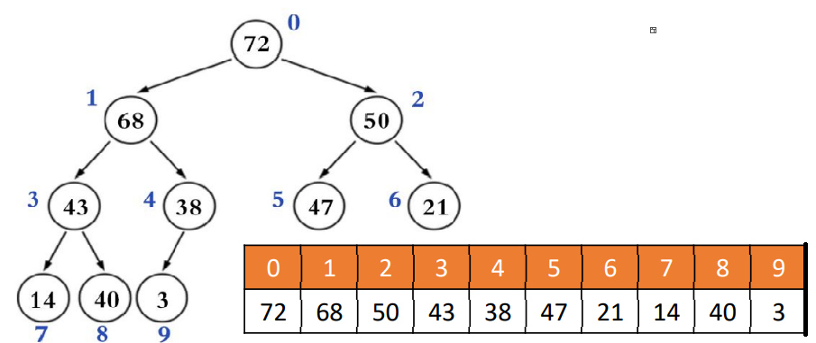

# 数据结构
## 动态数组 (Dynamic Array)

## 链表 (Linked List)

## 栈 (Stack)

## 队列 (Queue)

## 树 (Tree)

## 集合 (Set)

## 映射 (Map)

## 哈希表 (Hash Table)

## 二叉堆 (Binary Heap)

### 堆的一个重要性质：

任意节点的值总是>= (<=) 子节点的值

- 如果任意节点的值总是≥子节点的值，称为：最大堆、大根堆、大顶堆

- 如果任意节点的值总是≤子节点的值，称为：最小堆、小根堆、小顶堆

### 接口

```java
void add(E element);	// 添加元素
E get();	// 获得堆顶元素
E remove();	// 删除堆顶元素
E replace(E element);	// 删除堆顶元素的同时插入一个新元素
int size();	// 元素的数量
boolean isEmpty();	// 是否为空
void clear();	// 清空
```

### 二叉堆

二叉堆的逻辑结构就是一棵完全二叉树，所以也叫完全二叉堆

鉴于完全二叉树的一些特性，二叉堆的底层（物理结构）一般用数组实现即可：



```
索引 i 的规律（ n 是元素数量）
如果 i = 0 ，它是根节点

如果 i > 0 ，它的父节点的索引为 floor( (i – 1) / 2 )

如果 2i + 1 ≤ n – 1，它的左子节点的索引为 2i + 1
如果 2i + 1 > n – 1 ，它无左子节点

如果 2i + 2 ≤ n – 1 ，它的右子节点的索引为 2i + 2
如果 2i + 2 > n – 1 ，它无右子节点
```


对于二叉堆核心算法就是添加元素时的上滤和删除时的下滤

### 上滤

添加元素，首先将元素添加到数组末尾然后进行上滤操作。

```java
private void siftUp（int index）{
    // 传入需要上滤元素索引
    E element = elements[index];
    while(index > 0) {
        // 计算父节点索引
        int parentIndex = (index-1) >> 1;
        E parent = elements[parentIndex];
        //小于父节点
        if (compare(parent，element) >= 0) break;
        //将父元素安非到index位置
        elements[index]parent;
        index parentIndex;
    }
    elements[index] = element;
}
```


## 优先队列 (Priority Queue)

## Trie

## 哈夫曼树

## 并查集 (Union Find)

## 图 (Graph)

## 跳表 (Skip List)

## 串 (Sequence)